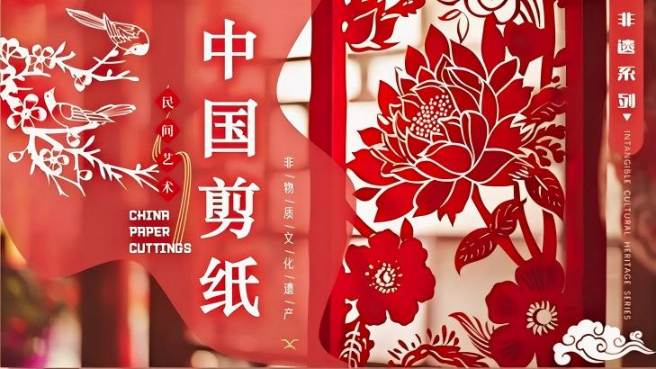

# 非遗文化科普平台



一个以**中国非物质文化遗产**为主题的科普展示网站，涵盖六大非遗门类的图文、音视频内容。

## 🌐 在线访问

**[https://xie-binjian.github.io/feiyi/](https://xie-binjian.github.io/feiyi/)**

## 📂 项目结构

```
feiyi/
├── index.html          # 首页（轮播图、卡片、数据看板）
├── css/
│   ├── style.css       # 全局公共样式
│   ├── home.css        # 首页专属样式
│   ├── detail.css      # 详情页共享样式
│   └── ask.css         # AI问答页样式
├── js/
│   └── main.js         # 核心脚本（轮播、AI问答、留言板）
├── html/
│   ├── paper.html      # 民间剪纸
│   ├── shadow.html     # 皮影戏
│   ├── kite.html       # 传统风筝
│   ├── face.html       # 戏曲脸谱
│   ├── clay.html       # 民间泥塑
│   ├── bamboo.html     # 传统竹编
│   └── ask.html        # AI问答助手
├── img/                # 图片资源
├── audio/              # 音频资源
└── video/              # 视频资源
```

## 🎨 六大非遗门类

| 门类 | 简介 |
|------|------|
| ✂️ 民间剪纸 | 指尖非遗，镂刻东方美学 |
| 🎭 皮影戏 | 灯影流转，千年民间戏曲 |
| 🪁 传统风筝 | 乘风而上，承载民俗祈愿 |
| 🎨 戏曲脸谱 | 五色油彩，演绎人物忠奸 |
| 🏺 民间泥塑 | 泥土塑万象，市井烟火艺术 |
| 🎋 传统竹编 | 一挑一压，编织生活器物 |

## 🛠️ 技术特点

- 纯原生 HTML / CSS / JavaScript，无框架依赖
- 响应式设计，适配桌面 / 平板 / 手机
- 轮播图、AI 问答（本地知识库）、留言板（localStorage）
- 无障碍 ARIA 属性支持
- 图片懒加载优化
- 系统字体栈，无需外部字体加载

## 🚀 本地运行

直接在浏览器中打开 `index.html` 即可，无需服务器。

> 💡 详情页的图表功能需要 Chart.js，离线时请将 `chart.min.js` 放入 `js/` 目录。

## 📊 数据来源

- [中国非物质文化遗产网](https://www.ihchina.cn/)
- [联合国教科文组织](https://whc.unesco.org/)
- [文化和旅游部](https://www.mct.gov.cn/)
